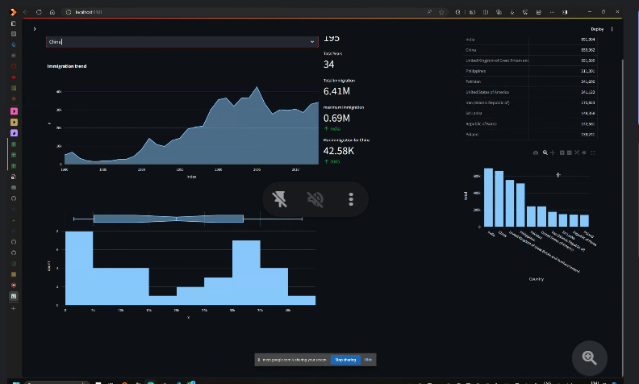

# Immigration Data Analysis

## Project Summary
The goal of this project is to analyze the United Nations dataset on international migration. The dataset contains information on the number of immigrants leaving coutries per year (1980-2013).

## Tech Stack 
- Python
- Pandas
- Plotly
- Streamlit
